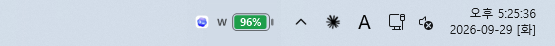
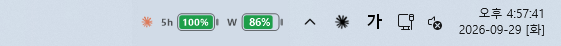
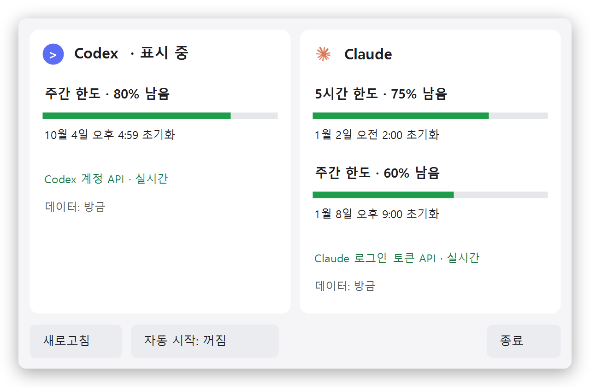

# Codex Usage Bar

**작업표시줄에 배터리 하나. Codex·Claude 남은 사용량을 한눈에.**

<p align="center">
  <br>
  <sub>Codex를 쓰는 중</sub><br><br>
  <br>
  <sub>Claude를 쓰는 중</sub>
</p>

지금 쓰고 있는 앱의 남은 한도를 작업표시줄에 배터리로 보여줍니다. **Codex를 앞에 띄우면 Codex, Claude를 띄우면 Claude 사용량으로 자동으로 바뀌고**, 게임이나 브라우저 같은 다른 앱으로 넘어가면 마지막 표시를 그대로 둡니다.

배터리마다 `5h`(5시간 한도)·`W`(주간 한도) 이름표가 붙습니다. 계정에 한도가 둘이면(Claude, Codex Plus 등) 두 개가 나란히, 주간 한도만 있으면 `W` 하나만 나옵니다.

배터리를 누르면 두 계정의 한도와 초기화 시각이 함께 나옵니다. 그게 전부입니다.

<p align="center">
  <picture>
    <source media="(prefers-color-scheme: dark)" srcset="docs/images/popup-dark.png">
    
  </picture>
</p>

## 설치

### Windows 10/11

PowerShell에서:

```powershell
git clone https://github.com/share-seoi/CodexUsageBar.git
cd CodexUsageBar
powershell -NoProfile -ExecutionPolicy Bypass -File .\windows\install.ps1
```

- 관리자 권한, .NET SDK, Node, Python 모두 필요 없습니다. Windows에 기본으로 있는 .NET Framework 4.8로 소스에서 바로 빌드합니다.
- `%LOCALAPPDATA%\Programs\CodexUsageBar`에 설치되고 바로 실행됩니다.
- 로그인할 때 자동으로 켜지게 하려면 명령 끝에 `-AutoStart`를 붙이거나, 위젯 상세 창의 **자동 시작** 버튼을 누르세요.
- 설치 전에 코드를 확인하고 싶다면 `.\windows\test.ps1`을 먼저 실행하세요. 네트워크 없이 합성 데이터로 동작을 검사합니다.

### macOS 13 이상

터미널에서:

```bash
git clone https://github.com/share-seoi/CodexUsageBar.git
cd CodexUsageBar
./scripts/build-app.sh
./scripts/install-lifecycle.sh
```

- Swift로 빌드하므로 Xcode 명령행 도구가 필요합니다. 없으면 `xcode-select --install`로 설치하세요.
- `~/Applications/Codex Usage Bar.app`에 설치됩니다. Codex나 Claude 앱을 열면 자동으로 켜지고, 둘 다 닫으면 꺼집니다.
- Mac에서는 작업표시줄 대신 **메뉴 막대**에 같은 이름표로 표시됩니다: 한도가 둘이면 `5h 63% · W 88%`, 주간만 있으면 `W 88%`.
- 처음 실행하면 macOS가 Claude 로그인 정보가 든 키체인 접근을 묻습니다. **항상 허용**을 누르면 다시 묻지 않습니다. 코드 서명, 진단 옵션 등 자세한 내용은 [macOS 안내](docs/macos.md)를 보세요.

## 사용법

1. Codex 또는 Claude 데스크톱 앱에 평소처럼 로그인해 둡니다.
2. 둘 중 하나를 열면 작업표시줄(Mac은 메뉴 막대)에 사용량이 나타납니다. 둘 다 닫으면 위젯도 숨습니다.
3. 배터리를 누르면 상세 창이 열립니다: **새로고침**, **자동 시작** 켜기/끄기, **종료**. Mac은 메뉴 막대 항목을 누르면 같은 내용이 메뉴로 나옵니다.

남은 양이 적으면 배터리가 빨갛게 바뀝니다.

## 어떻게 읽어 오나요

- **Codex:** 로컬 세션 기록을 20초마다 확인하고, 시작·새로고침 때 Codex 앱 서버로 계정 한도를 한 번 조회합니다.
- **Claude:** 이 PC에 저장된 Claude 로그인 토큰을 **읽기만** 해서 사용량 API를 조회합니다. 배터리가 Claude를 표시 중이면 1분, 아니면 3분 간격이고, Claude로 전환하거나 상세 창을 열면 바로 새로 받아옵니다. 모델 추론은 요청하지 않습니다.
- 배터리가 흐려지면 표시 중인 숫자가 10분 넘게 갱신되지 않았다는 뜻입니다. 이유는 상세 창에 나옵니다.
- 토큰을 복사·수정·전송하지 않으며, 저장소에도 계정 정보는 들어 있지 않습니다. 설치하는 사람의 PC에 로그인된 계정이 표시됩니다.

자세한 동작과 진단 옵션은 [Windows 안내](windows/README.md)를 참고하세요.

## 제거

**Windows**

1. 자동 시작을 켰다면 위젯 상세 창에서 먼저 끕니다.
2. 상세 창에서 **종료**를 누릅니다.
3. `%LOCALAPPDATA%\Programs\CodexUsageBar`(프로그램)와 `%LOCALAPPDATA%\CodexUsageBar`(마지막 사용량 캐시) 폴더를 지웁니다.

**macOS**

1. 저장소 폴더에서 `./scripts/uninstall-lifecycle.sh`를 실행해 자동 실행을 해제합니다.
2. 메뉴에서 종료한 뒤 `~/Applications/Codex Usage Bar.app`을 지웁니다.

## 참고

- 개인이 만든 비공식 도구이며 OpenAI, Anthropic과 관계가 없습니다.
- 사용량 조회에 쓰는 API는 공개적으로 보장된 API가 아니어서, 앱이 업데이트되면 동작이 바뀔 수 있습니다.
- 에이전트(Codex, Claude Code 등)에게 설치를 맡길 때는 [AGENTS.md](AGENTS.md)를 읽게 하면 됩니다.

## 라이선스

[MIT](LICENSE)
